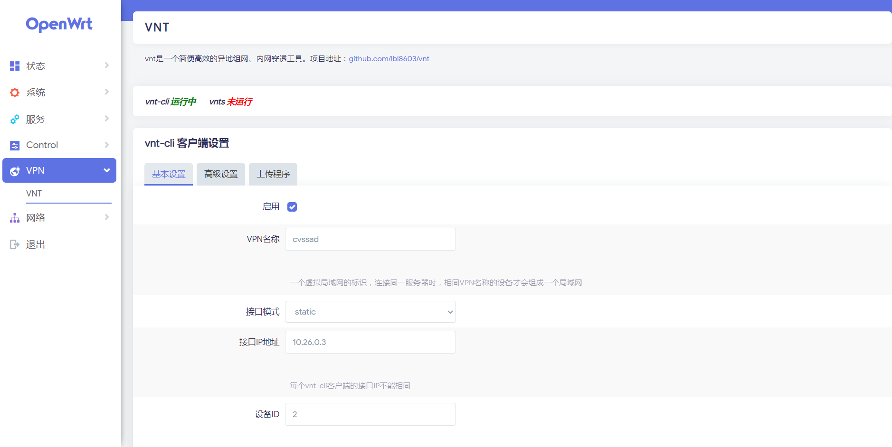
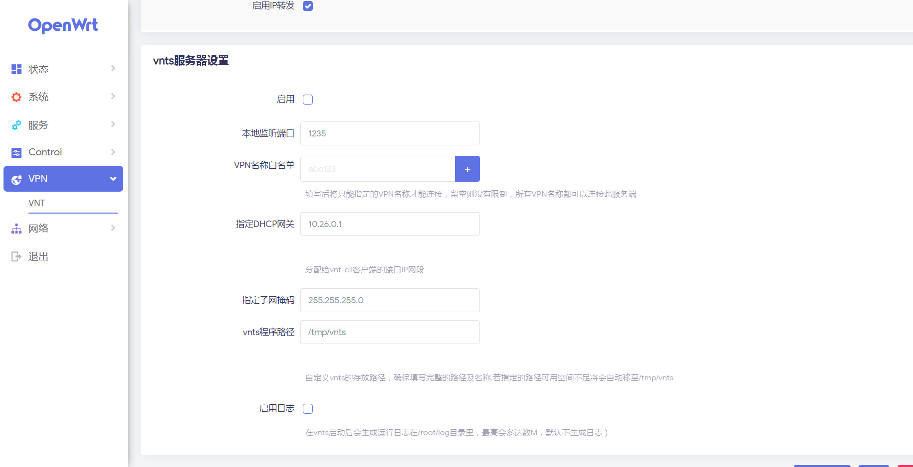
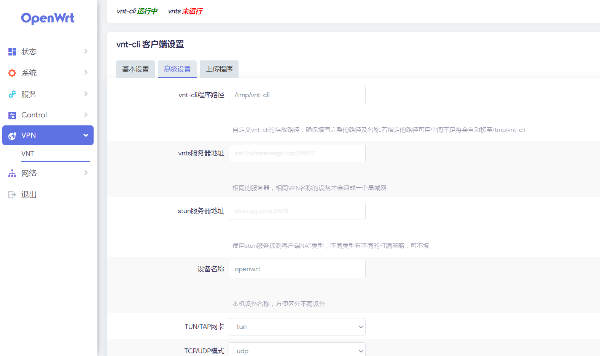
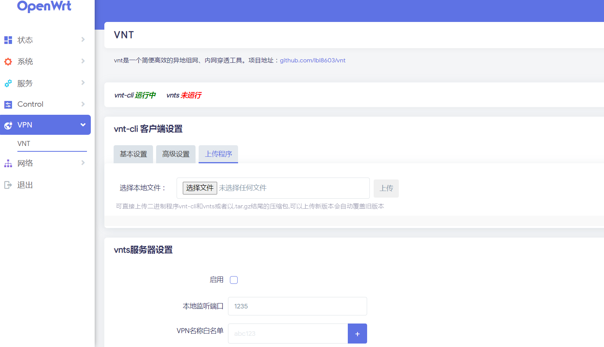
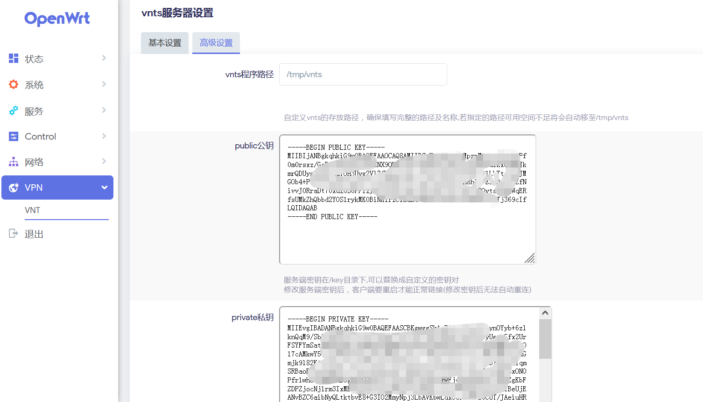
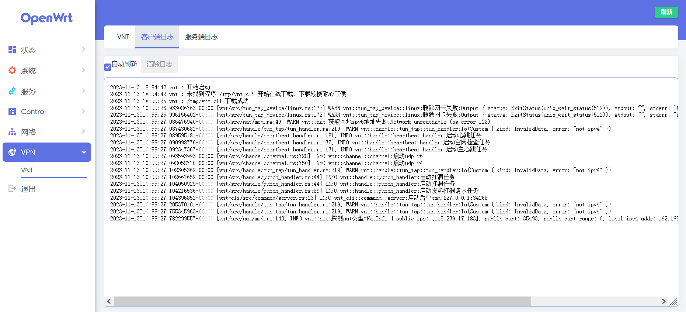

# luci-app-vnt

<a href="https://github.com/lmq8267/luci-app-vnt/releases">
<a href="https://github.com/lmq8267/luci-app-vnt/graphs/contributors">
<a href="https://github.com/lmq8267/luci-app-vnt/releases/">
<a href="https://github.com/lmq8267/luci-app-vnt/issues">
<a href="https://github.com/lmq8267/luci-app-vnt/discussions">
<a href="GitHub repo size">
<a href="https://github.com/lmq8267/luci-app-vnt/actions?query=workflow%3ABuild">

项目地址：https://github.com/lbl8603/vnt

非专业，编写自用，有大佬完善一下也好，自1.2.9版本起可以多开了，要是有大佬重写一个可以支持多开、多配置快速切换 就好啦，多配置快速切换

需要依赖luci-lib-fs和komd-tun 手动去系统自带的软件包里先安装好吧 

### UI预览 ###

